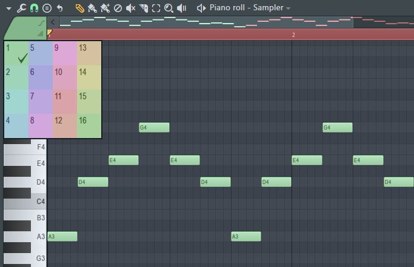
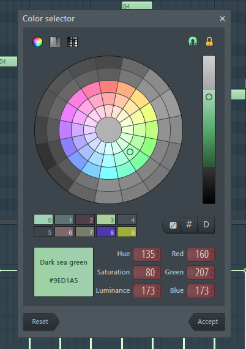
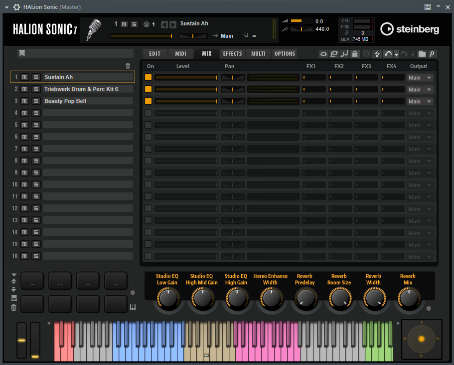
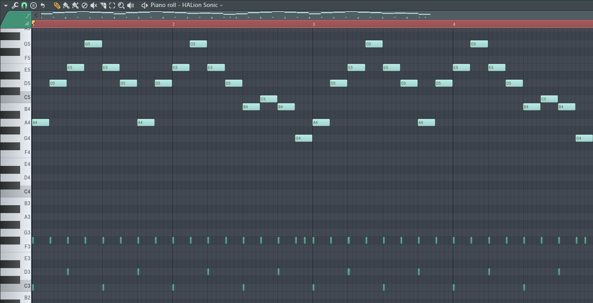
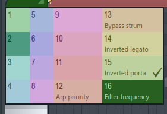
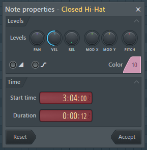
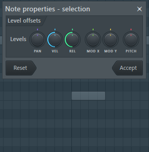
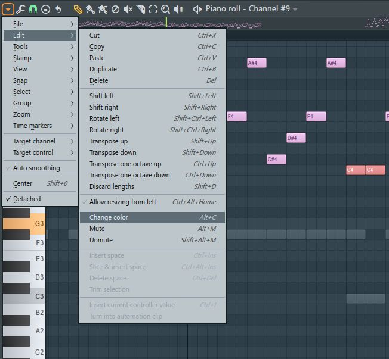

## 引入

如图所示的，是你使用 FL Studio 过程中用得最多界面之一：「钢琴卷帘」。

在 Draw 模式下，你可以在这个窗口中写下绿色的音符。

有一天，你发现在左上角的色块处可以改变音符的颜色——

 

左键单击可以在 16 个颜色中选择一个，右键单击则可以自定义当前选中的颜色。

你觉得默认的绿色看厌了，于是左键换了一个颜色。

再写新的音符，音符的颜色就改变了......

**然后，你就解锁了这个功能的错误用法！** (￣▽￣|||)

事实上，这是用来在一个乐器上写不同 MIDI 通道[^1]的音符的。

即标题所说的 **「MIDI 多通道编辑」**。

## 正确的用法

左键点击弹出的菜单中，编号为 1 ~ 16 的 16 个颜色对应了 16 个 MIDI 通道。

用不同的颜色写音符，播放时就会把音符发送到当前乐器对应的通道上。就是这样。

颜色不同只是为了标识不同 MIDI 通道的音符。(‾◡◝)

## 有什么用？

### 多通道的 VSTi

如果你经常和 VST 乐器打交道，你应该用过像 Kontakt、HALion 这样的采样器。

那么你应该已经想到了，在这样的采样器里是可以同时挂载多个音色实例[^2]的：

而每一个音色分别由对应编号的 MIDI 通道的信号控制。

所以，如果需要挂载多个音色到这样的采样器上，但是出于某种原因，觉得使用 MIDI Out 太碍事的话，就可以改变音符的「颜色」后直接写在采样器的 Channel[^3] 里。

对于其他支持多通道输入的 VST 乐器，也可以这么干。比如需要在一些鼓机上混用两套鼓的时候。

但是由于音符可能会重叠，很多情况下使用 MIDI Out 会更方便[^4]。~~（你要挂两个 VST 也不是不行~~

### 某些插件的特殊音符

有的插件利用了空闲的 MIDI 通道来实现一些特殊用法，比如 FL 自带的 Harmor。

使用 Harmor 时，在选择颜色的菜单里，后 5 个通道会有对应功能的说明文字。

差不多是 Keyswitch 那样的东西。

具体用法请自行查阅 [Harmor 的官方文档](https://www.image-line.com/fl-studio-learning/fl-studio-online-manual/html/plugins/Harmor.htm) 中的「Special note colors」部分。

## 小技巧——快速修改音符的通道

在套 MIDI 的时候，如果直接在主界面的 `File -> Import -> MIDI File...` 处导入 MIDI，会发现得到的 Pattern 里的音符都是带对应 MIDI 通道的颜色的。

如果直接复制到多通道 VST 乐器里，可能就不能正常播放了。

而选中多个音符时，双击音符又不能批量更改音符的颜色。

 

怎么办？套一层 MIDI Out[^4] 吗？~~我之前还真是这么干的。~~

不需要这么做，~~稍微想一下就知道既然有这个需求怎么可能没做这个功能。~~

先左键单击左上角的色块选好想要的颜色（MIDI 通道），再选中要修改颜色的音符，打开左上角的小三角菜单，选择 `Edit -> Change color` 即可批量修改颜色。

可以看到 Windows 下的快捷键是 `Alt + C`，按下快捷键可以达到同样的效果。

全文完。

[^1]: 关于 MIDI 的「通道」概念，请自行查阅有关手册或说明。

[^2]: 此处表述或不严谨。

[^3]: 此指 FL Studio「通道机架」界面中的「通道」概念，为了区分称作「Channel」。

[^4]: 关于 MIDI Out 插件的使用，请自行查阅相关的教程或[官方文档](https://www.image-line.com/fl-studio-learning/fl-studio-online-manual/html/plugins/MIDI%20Out.htm)。