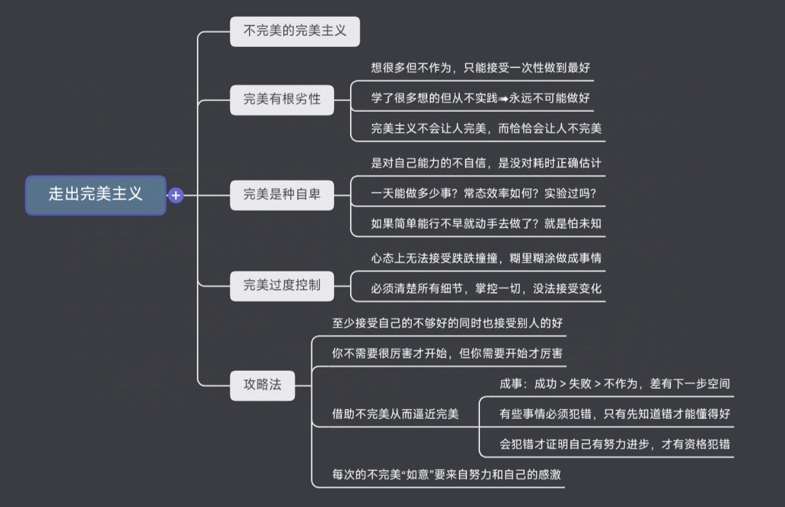

## 摘编

<iframe src="https://www.bilibili.com/blackboard/html5mobileplayer.html?aid=1406657347&bvid=BV18r421T7gM&cid=1662342904&p=1&hideCoverInfo=1&hasMuteButton=1"
    scrolling="no"
    frameborder="no"
    framespacing="0"
    allowfullscreen="true"
    style="width:100%;aspect-ratio:16/9;"
    >
</iframe>

摘自 Maki的完美算数教室的「数学与认知方法讲座」 [第140讲 如何克服完美主义](https://www.bilibili.com/video/BV18r421T7gM/)。

因为和个人最近“利用不完美”的一些想法比较符合，遂摘编。

---

## 总结

借用评论区 [@栐陆离](https://space.bilibili.com/590191743) 的思维导图作为总结。

